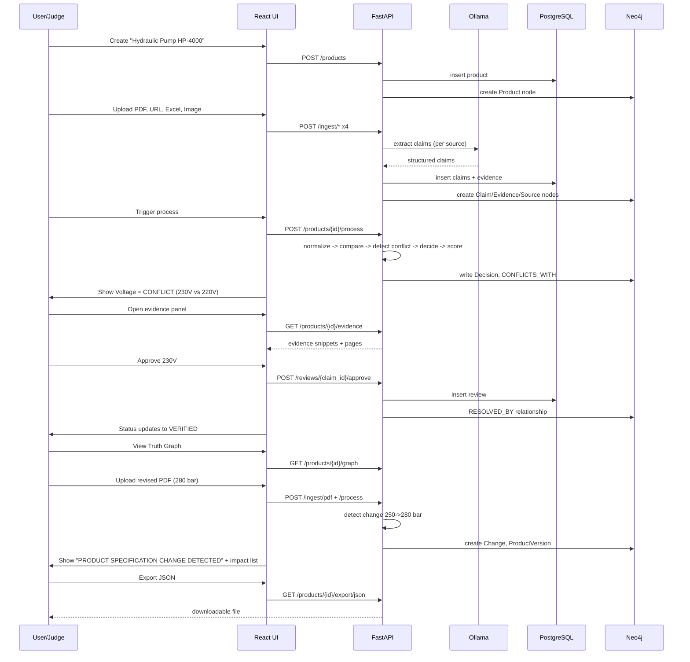

# Industrial Product Truth Engine
# Implementation Plan

**Companion to:** `01_PRD.md`, `02_SYSTEM_ARCHITECTURE.md`
**Purpose:** Execution-ready build plan for Google Antigravity and the hackathon team
**Time budget:** 6h30m aggressive / 7h00m safe
**Governing rule:** WORKING END-TO-END PRODUCT > ARCHITECTURAL PERFECTION

---

## 0. How to Use This Document

1. Read `01_PRD.md` (what to build), then `02_SYSTEM_ARCHITECTURE.md` (how it's structured), then this document (in what order, in what time, with what fallback).
2. Build the **vertical slice** first (Section 3). Do not build all-frontend-then-all-backend.
3. Every phase has a hard time box. If a task exceeds its allotted time by more than **15 minutes**, apply the documented fallback (Section 13) and move on. Do not let one blocked feature consume the schedule.
4. P0 is non-negotiable. P1/P2/P3 are cut in that order if time runs short. Never cut P0 to add P1.
5. After each phase, hit its **Checkpoint** (Section 12) before starting the next phase's new features.

---

## 1. Project Snapshot

| | |
|---|---|
| Product | Industrial Product Truth Engine |
| Hackathon | UniHack 2026 — "AI-Powered Product Intelligence for Industrial Commerce" |
| Demo product | Industrial Hydraulic Pump |
| Demo inputs | Manufacturer PDF, manufacturer website, product image, supplier Excel, technical manual |
| Core philosophy | "Extraction is not truth." Every attribute: SOURCE → CLAIM → EVIDENCE → NORMALIZATION → COMPARISON → DECISION → CONFIDENCE → TRUST STATUS |
| Governing constraint | ~6–7 hours of actual implementation time |

---

## 2. Final Technology Stack (Locked)

| Layer | Technology |
|---|---|
| Frontend | React + Vite + TypeScript + Tailwind CSS |
| Backend | Python + FastAPI + Pydantic |
| Document intelligence | Docling |
| Web ingestion | Crawl4AI (primary), Playwright (fallback) |
| OCR | Docling OCR, RapidOCR/Tesseract fallback |
| Vision-language | Qwen-VL (or equivalent local VLM via Ollama) |
| Local LLM | Ollama |
| Model fallback | OpenRouter (optional) |
| Vector DB | Qdrant |
| Knowledge graph | Neo4j Community Edition |
| Relational DB | PostgreSQL (or Supabase Postgres) |
| Orchestration | Explicit Python services; LangGraph only if it adds real value (P2) |

No dependency substitutions unless a technology is provably impossible to run on available hardware — in which case, apply Section 13 fallback and log the deviation.

---

## 3. Vertical Slice Definition (Build This First)

**Do not build all-frontend-then-all-backend-then-AI-then-database.** Build one thin path through the entire system first:

```
ONE PDF → PARSE → EXTRACT CLAIMS → NORMALIZE → EVIDENCE → NEO4J → UI DISPLAY
```

**Vertical Slice 1 Definition of Done:**
1. Upload one manufacturer PDF for a new product.
2. Docling parses it into structured blocks (page/table preserved).
3. Ollama extracts ≥3 claims (e.g., voltage, power, pressure) as validated Pydantic objects.
4. Each claim has a linked Evidence record with page number and verbatim text.
5. Power claim is normalized (e.g., "5 HP" → 3.73 kW canonical).
6. Product/Attribute/Claim/Evidence/Source/Document nodes exist in Neo4j with correct relationships.
7. The frontend displays the product with its attributes, canonical values, and evidence on one screen.

Only after this slice works end-to-end do you expand to: multiple sources → conflict detection → confidence/trust status → human review → versioning/change detection → URL/Excel/image ingestion → export.

---

## 4. Tool Responsibility Matrix

| Task | Tool | Why | Input | Output | Priority |
|---|---|---|---|---|---|
| PDF parsing | Docling | Layout-aware, preserves page/table/bbox provenance | Raw PDF | Structured document blocks | P0 |
| Website extraction | Crawl4AI → Playwright fallback | LLM-ready content extraction; Playwright covers JS-heavy pages | Product URL | Structured page content | P1 |
| OCR | Docling OCR → Tesseract/RapidOCR | Handles scanned pages/images | Scanned PDF / image | Text with location | P0 (PDF path) / P1 (image path) |
| Visual understanding | Qwen-VL (Ollama) | Local multimodal label/spec reading | Product image | Structured label claims | P1 |
| LLM extraction | Ollama | Local, free, private, offline-capable | Parsed document text | Claim JSON (Pydantic) | P0 |
| LLM fallback | OpenRouter | Only if Ollama unreachable | Same as above | Same as above | Optional |
| Structured output | Pydantic | Enforces schema, rejects malformed output | LLM raw output | Validated claim objects | P0 |
| Unit conversion | Deterministic Python (`pint`-style or custom conversion table) | No LLM arithmetic, auditable factors | Raw value + unit | Normalized value + unit | P0 |
| Embeddings | Local embedding model (e.g., `nomic-embed-text` via Ollama) | Free, local, fast | Evidence/claim text | Vector | P0 (basic) |
| Vector retrieval | Qdrant | Filterable payload search | Query + filters | Ranked evidence | P0 (basic) |
| Relationship reasoning | Neo4j | Multi-hop provenance/conflict/change traversal | Product truth entities | Traversable graph | P0 |
| Operational data | PostgreSQL | Transactional system of record | All entities | Relational rows | P0 |
| Backend | FastAPI | Async, schema-validated APIs | HTTP requests | JSON responses | P0 |
| Frontend | React + Vite + TS | Fast iteration, typed UI | API data | Rendered UI | P0 |
| Styling | Tailwind CSS | Utility-first, fast to build a data-dense dashboard | — | Styled components | P0 |
| Graph visualization | A lightweight React graph library (e.g., `react-force-graph` or a simple custom SVG renderer over a bounded Cypher result) | Visual provenance view | Bounded subgraph JSON | Rendered graph | P1 (structured table fallback is P0-safe) |

---

## 5. AI Provider Strategy (Implementation-Level)

```
Application → AIProvider interface → OllamaProvider (primary) → Ollama → local model
                                    ↘ OpenRouterProvider (fallback, optional) → OpenRouter
```

**File:** `backend/app/core/ai_provider.py`

```python
class AIProvider(ABC):
    async def generate(self, prompt: str, **kwargs) -> str: ...
    async def generate_structured(self, prompt: str, schema: type[BaseModel], **kwargs) -> BaseModel: ...
    async def embed(self, text: str) -> list[float]: ...
    async def vision_generate(self, image_bytes: bytes, prompt: str, schema: type[BaseModel] | None = None) -> Any: ...
```

**Resolution order at every call site (implemented once, in `core/model_gateway.py`, reused everywhere):**
1. Ping `OLLAMA_BASE_URL`. If healthy → use `OllamaProvider`.
2. Else, if `OPENROUTER_API_KEY` is set → use `OpenRouterProvider`.
3. Else → raise `AIProviderUnavailableError`, mark job `FAILED` with explicit message. Never proceed with a fabricated result.

Env vars (add to `.env.example` immediately in Phase 0):

```
AI_PROVIDER=ollama
OLLAMA_BASE_URL=http://localhost:11434
OLLAMA_MODEL=
OLLAMA_VISION_MODEL=
EMBEDDING_MODEL=
OPENROUTER_API_KEY=
OPENROUTER_MODEL=
```

**Model sizing by hardware (choose OLLAMA_MODEL at Phase 0, do not hardcode blind):**

| Hardware | Text model | Vision model | Embedding model |
|---|---|---|---|
| Low-end CPU only | `qwen2.5:3b` or `llama3.2:3b` | Skip VLM; OCR-only fallback | `nomic-embed-text` |
| Mid-range laptop (16GB+ RAM) | `qwen2.5:7b` | `qwen2.5vl:7b` (if it fits) | `nomic-embed-text` |
| GPU available | `qwen2.5:14b`+ | `qwen2.5vl:7b`/`qwen2-vl:7b` | `nomic-embed-text` or `bge-base` |

Pick the largest tier that comfortably runs at Phase 0 and pin it in `.env` — do not change models mid-build.

---

## 6. AI Prompt Implementation (Separate Prompts, Not One Mega-Prompt)

| # | Prompt | Input | Output schema | Failure handling |
|---|---|---|---|---|
| 1 | Product entity extraction | Document header/title blocks | `ProductIdentity {name, manufacturer, model_number, category}` | Retry once with correction prompt; else `REVIEW_REQUIRED` for entity resolution |
| 2 | Attribute extraction | Document block/table text | `list[RawAttributeCandidate {attribute, raw_value, unit, evidence_text, location}]` | Retry once; else skip block, log `EXTRACTION_FAILED` |
| 3 | Evidence extraction | Same block as #2 (co-produced, not separate call where possible) | Embedded in `RawAttributeCandidate.evidence_text` | If evidence_text missing/empty, discard the candidate — no claim without evidence |
| 4 | Semantic unit interpretation | Ambiguous unit strings (e.g., "5hp", "≈230V") | `{value: float, unit: str, is_approximate: bool}` | If ambiguous unit not resolvable, mark `normalization_status=UNSUPPORTED` |
| 5 | Conflict explanation | Competing claim groups + scores | `{decision_reason: str}` (text only — does not decide the winner) | If generation fails, use a template-based reason string as fallback |
| 6 | Canonical candidate reasoning | Scored groups (Section 8 scoring) | `{decision_reason: str}` referencing supporting claim IDs | Same fallback as #5 |

Rule: prompts 5 and 6 **explain** a decision already computed deterministically (Section 8) — they never make the decision themselves. This keeps the truth pipeline auditable even if the LLM's phrasing varies.

**Structured output validation rule (applies to all 6 prompts):** LLM output → Pydantic `model_validate()`. If it fails → retry once with a correction prompt appending the validation error. If it fails again → mark `EXTRACTION_FAILED`, do not insert into claims table.

---

## 7. AI Call Optimization

- One extraction call per document **section** (not per sentence, not per whole-document blob).
- Deterministic code (not LLM) handles: unit conversion, ID generation, hashing, timestamps, claim grouping/comparison, confidence scoring math.
- LLM is used only for: entity naming, attribute/value/evidence extraction, semantic equivalence judgment calls, and natural-language explanation generation.
- Cache: parsed documents keyed by content hash (skip re-parsing identical re-uploads); embeddings keyed by text hash; do not re-extract a document already successfully processed unless `reprocess=true`.

---

## 8. Deterministic Engines (Implementation Detail)

**Normalization (`backend/app/normalization/units.py`):**

```python
CONVERSIONS = {
    ("HP","kW"): lambda v: v * 0.7457,
    ("W","kW"): lambda v: v / 1000.0,
    ("bar","psi"): lambda v: v * 14.5038,
    ("mm","inch"): lambda v: v / 25.4,
    ("kg","lb"): lambda v: v * 2.20462,
    ("F","C"): lambda v: (v - 32) * 5.0/9.0,
}
# RPM, Nm, V, A: no cross-unit conversion, equivalence check only
```

**Conflict scoring (`backend/app/conflict/scorer.py`):** group claims by normalized value; score each group:

```
group_score = (
    0.30 * avg_source_authority +
    0.25 * independent_source_count_normalized +
    0.20 * evidence_exactness_score +
    0.15 * recency_score +
    0.10 * extraction_confidence_avg
)
```

If top two group scores differ by less than `CLOSENESS_THRESHOLD` (default `0.10`) → status `CONFLICT`. Else the top group is the canonical candidate.

**Trust status rule (`backend/app/truth/status.py`):**

| Status | Condition |
|---|---|
| VERIFIED | ≥1 claim with `authority_score ≥ 0.8`, OR ≥2 independent agreeing sources, AND no competing group within threshold |
| INFERRED | Only one low/medium authority source, or evidence is indirect |
| CONFLICT | ≥2 credible groups within closeness threshold |
| UNKNOWN | Zero claims for the attribute |

**Confidence (`backend/app/truth/confidence.py`):** weighted sum per Section 19/25 of the architecture doc (authority 0.25, agreement 0.25, evidence quality 0.20, recency 0.10, extraction certainty 0.10, normalization certainty 0.10). Always return the breakdown object, never a bare float.

---

## 9. Database Implementation Order

**PostgreSQL table creation order (respects FK dependencies):**

1. `products`
2. `documents`
3. `sources`
4. `attributes`
5. `claims` (FK → products, attributes, sources, documents)
6. `evidence` (FK → claims, documents)
7. `decisions` (FK → attributes, claims)
8. `reviews` (FK → claims, decisions)
9. `product_versions` (FK → products)
10. `changes` (FK → product_versions, attributes)
11. `assets`
12. `processing_jobs` (FK → products)
13. `source_authority_config` (standalone, seed with Section 21/PRD Section 17 defaults)

Each table: UUID PK, relevant FKs, `created_at`/`updated_at`, `status` where applicable, `metadata JSONB` for extensibility. Use Alembic (or a single `init.sql` if time-constrained) — for a 6-hour build, a single idempotent `schema.sql` run at container startup is acceptable; do not spend time setting up a full migration framework unless it's already familiar to the team.

## 10. Neo4j Implementation Order

1. `neo4j/constraints.cypher` — uniqueness constraints (product_id, claim_id, evidence_id, source_id, document_id, attribute_id, version_id, change_id).
2. `neo4j/indexes.cypher` — index on `Claim.status`, `Source.source_type`.
3. Product node creation (on product creation API call).
4. Source + Document node creation (on ingestion).
5. Attribute node creation (from schema, seeded once).
6. Claim node creation (on extraction).
7. Evidence node creation + `SUPPORTED_BY`/`EXTRACTED_FROM`/`FROM_SOURCE` relationships.
8. `CONFLICTS_WITH` relationships (on conflict detection).
9. `Decision` node + `RESOLVED_BY`/`SELECTS` (on canonical decision / review).
10. `ProductVersion` + `HAS_VERSION`/`SUPERSEDES` (Phase 8, P1).
11. `Change` + `HAS_CHANGE` (Phase 8, P1).
12. `Asset` + `AFFECTS` (Phase 8, P1).

Run `constraints.cypher` and `indexes.cypher` once at Phase 1 (backend foundation), before any data is written — this avoids duplicate-node bugs later under time pressure.

## 11. Qdrant Implementation

- One collection: `product_evidence`.
- Vector: embedding of `evidence.text` (or `claim.attribute + raw_value` for claims collection if time allows a second collection; otherwise fold into one collection with a `content_type` payload field).
- Payload: `product_id, document_id, source_id, claim_id, evidence_id, page, content_type, timestamp`.
- Insertion service: `backend/app/retrieval/qdrant_service.py` — `upsert_evidence(evidence: Evidence)`.
- Search service: `search_evidence(product_id, attribute=None, query_text=None, top_k=5)` — filters first (`product_id`, optionally `attribute`), then vector similarity.
- Do not build reranking (P2) or multi-collection architecture for the MVP — one collection, filter-then-search, is sufficient to demonstrate semantic evidence retrieval.

---

## 12. Checkpoints

| # | Checkpoint | Verifies |
|---|---|---|
| 1 | Backend starts | `GET /health` returns 200; Postgres/Neo4j/Qdrant connections succeed |
| 2 | PDF parses | Docling returns structured blocks with page numbers for the demo datasheet |
| 3 | Claims generated | ≥3 claims created from the PDF, each Pydantic-valid |
| 4 | Evidence visible | `GET /products/{id}/evidence` returns evidence with page + verbatim text |
| 5 | Normalization works | 5 HP claim shows `normalized_value=3.73, unit=kW` |
| 6 | Conflict works | Uploading the website source (220V) against the PDF (230V) produces `status=CONFLICT` |
| 7 | Truth decision works | Canonical candidate + `decision_reason` returned for voltage |
| 8 | Neo4j populated | Cypher query traverses Product→Attribute→Claim→Evidence→Source for the demo product |
| 9 | Dashboard works | Product Truth Workspace renders attributes, status, confidence, evidence in the browser |
| 10 | Change detection works | Uploading a revised PDF with 280 bar (vs. prior 250 bar) creates a `Change` record and new `ProductVersion` |

**Rule:** if a checkpoint fails, STOP adding new features. Fix the checkpoint before proceeding to the next phase's new work.

---

## 13. Hard-Stop Fallback Table

If any item blocks progress for more than **15 minutes**, apply its fallback immediately.

| Blocker | Fallback | Max time before switching |
|---|---|---|
| Ollama model too slow / doesn't fit RAM | Switch to smaller model tier (Section 5 table); if still blocked, use OpenRouter free model | 15 min |
| Ollama unreachable entirely | OpenRouter fallback (if `OPENROUTER_API_KEY` available); else proceed with mocked/manual claim entry for demo continuity, clearly logged | 15 min |
| Qwen-VL / VLM unavailable or fails to load | OCR-only fallback for image pipeline; mark `evidence_type=IMAGE_OCR` | 15 min |
| Crawl4AI blocked/broken | Playwright fallback; if that also fails, accept pasted HTML/text as a manual input path for the demo URL source | 15 min |
| Neo4j Docker container fails | Install/run Neo4j Desktop or a local binary directly; do not lose more than 15 min to container debugging | 15 min |
| Qdrant failure | Use an in-memory list + cosine similarity function for development continuity; restore real Qdrant before final demo if time allows | 15 min |
| Docling parsing issue on a specific PDF | Swap demo PDF for a cleaner synthetic one (Section 15); do not debug Docling internals mid-build | 15 min |
| OCR failure on image | Skip that claim; product still has voltage from PDF/manual/website — image is corroborating, not required | 10 min |
| LLM returns malformed JSON repeatedly | Fall back to a stricter regex/rule-based extractor for the specific demo attributes (voltage, power, pressure) as a safety net | 15 min |
| Graph visualization library issues | Show the graph as a structured table/tree view instead of a force-directed graphic | 15 min |
| Supabase/cloud Postgres unreachable | Switch to local PostgreSQL via Docker immediately | 10 min |

**Golden rule:** no single optional feature is allowed to consume more than 15 minutes beyond its budget. When in doubt, cut to P1/P2/P3 and keep the core truth pipeline (P0) intact.

---

## 14. File-by-File Implementation List

```
backend/
  app/
    main.py                                  # FastAPI app entrypoint, router registration
    core/
      config.py                              # env var loading (pydantic-settings)
      ai_provider.py                         # AIProvider interface + Ollama/OpenRouter impls
      model_gateway.py                       # provider resolution + task routing
      db.py                                  # PostgreSQL session/engine
      neo4j_client.py                        # Neo4j driver wrapper
      qdrant_client.py                       # Qdrant client wrapper
    models/
      product.py
      claim.py
      evidence.py
      decision.py
      review.py
      version.py
      change.py
    schemas/
      product.py
      claim.py
      evidence.py
      decision.py
      export.py
    api/
      health.py                              # GET /health
      products.py                            # product CRUD
      ingestion.py                           # POST /ingest/pdf, /ingest/url, /ingest/excel, /ingest/image
      processing.py                          # POST /products/{id}/process, /reprocess
      attributes.py                          # GET /products/{id}/attributes
      evidence.py                            # GET /products/{id}/evidence
      conflicts.py                           # GET /products/{id}/conflicts
      graph.py                               # GET /products/{id}/graph
      versions.py                            # GET /products/{id}/versions, /changes
      reviews.py                             # POST /reviews/{claim_id}/approve|reject
      export.py                              # GET /products/{id}/export/json|csv
    ingestion/
      pdf_ingest.py                          # Docling pipeline for PDF/manual
      url_ingest.py                          # Crawl4AI/Playwright pipeline
      excel_ingest.py                        # pandas/openpyxl pipeline
      image_ingest.py                        # OCR + VLM pipeline
      hashing.py                             # content hash + dedup check
    extraction/
      claim_extractor.py                     # prompts #1/#2 orchestration
      prompts.py                             # all 6 prompt templates (Section 6)
    normalization/
      units.py                               # deterministic conversion table
      normalizer.py                          # apply conversions to claims
    evidence/
      evidence_service.py
    conflict/
      scorer.py                              # group scoring (Section 8)
      conflict_detector.py
    truth/
      status.py                              # VERIFIED/INFERRED/CONFLICT/UNKNOWN rules
      confidence.py                          # weighted scoring
      decision_engine.py                     # canonical value selection + reason generation
    graph/
      neo4j_service.py                       # node/relationship writes and Cypher queries
    retrieval/
      qdrant_service.py
      embedding_service.py
    versioning/
      version_service.py
    change_detection/
      change_service.py
    impact/
      impact_service.py                      # IMPACT_MAP + level scoring
    review/
      review_service.py
    export/
      export_service.py
    services/
      entity_resolution_service.py
    repositories/
      product_repo.py
      claim_repo.py
      evidence_repo.py
      decision_repo.py
      review_repo.py
      version_repo.py
      change_repo.py
    tests/
      test_units.py
      test_conflict.py
      test_confidence.py
      test_status.py
      test_pipeline_e2e.py
  pyproject.toml
  requirements.txt

neo4j/
  constraints.cypher
  indexes.cypher
  seed.cypher
  queries.cypher

frontend/
  src/
    pages/
      Dashboard.tsx
      ProductWorkspace.tsx
      SourceManager.tsx
      EvidenceExplorer.tsx
      ConflictReview.tsx
      TruthGraph.tsx
      ChangeIntelligence.tsx
      Export.tsx
    components/
      ProductHeader.tsx
      ProductQualityScore.tsx
      AttributeTable.tsx
      ClaimCard.tsx
      EvidencePanel.tsx
      ConflictCard.tsx
      SourceAuthorityBadge.tsx
      TrustStatusBadge.tsx
      ConfidenceIndicator.tsx
      ReviewPanel.tsx
      GraphViewer.tsx
      ChangeTimeline.tsx
      ImpactPanel.tsx
      ExportPanel.tsx
    hooks/
      useProduct.ts
      useAttributes.ts
      useEvidence.ts
      useReviewQueue.ts
      useJobStatus.ts
    services/
      apiClient.ts
    types/
      index.ts
  package.json

data/demo/hydraulic_pump/
  manufacturer_datasheet.pdf
  manufacturer_manual.pdf
  supplier_catalog.xlsx
  product_label.jpg
  product_page.html

scripts/
  seed_demo.py
  smoke_test.sh

docs/
  01_PRD.md
  02_SYSTEM_ARCHITECTURE.md
  03_IMPLEMENTATION_PLAN.md

.env.example
docker-compose.yml
README.md
Makefile
```

---

## 15. Demo Data Preparation

```
data/demo/hydraulic_pump/
    manufacturer_datasheet.pdf     # Voltage=230V, Power=5HP, Pressure=250 bar (v1) / 280 bar (v2)
    manufacturer_manual.pdf        # Voltage=230V, Power=3.73kW
    supplier_catalog.xlsx          # Voltage=220V, Power=3730W (conflicting voltage, agreeing power)
    product_label.jpg              # Voltage=230V, model number visible
    product_page.html              # Voltage=220V (conflicting)
```

If real manufacturer documents are unavailable, generate synthetic files with these exact values so the conflict/normalization/change scenarios in the demo script (Section 21) work deterministically. **Every synthetic file must include a visible "DEMO DATA — SYNTHETIC" watermark/footer** and must never be presented as real manufacturer material. Build this data first, during Phase 0, in parallel with environment setup — the whole pipeline depends on it existing early.

---

## 16. Testing Plan

**Unit tests** (`backend/app/tests/`): unit conversion correctness, claim grouping, conflict detection scoring, source authority lookup, confidence calculation, status classification.

**Integration tests:** Docling parse smoke test, Ollama generate/generate_structured smoke test, Neo4j write/read round-trip, Qdrant upsert/query round-trip, PostgreSQL repository CRUD.

**End-to-end:** PDF → claims → evidence → normalization → conflict → truth → Neo4j → UI, run against the demo dataset.

**Required scenario tests:**

| Scenario | Input | Expected result |
|---|---|---|
| 1 | 230V (PDF/manual/image) vs 220V (website/Excel) | `status=CONFLICT`, both groups present with counts, evidence intact for all 5 claims |
| 2 | 5 HP / 3.73 kW / 3730 W | Recognized as one normalized Power attribute, `status=VERIFIED` |
| 3 | 250 bar → 280 bar across versions | `Change` created, new `ProductVersion`, impact list generated, both versions retrievable |
| 4 | Attribute with zero supporting claims | `status=UNKNOWN`, no value fabricated |
| 5 | Same PDF uploaded twice | Detected via content hash, not re-parsed/re-extracted, no duplicate claims created |

---

## 17. Definition of Done (MVP)

1. User can create a product.
2. User can upload a PDF.
3. Docling extracts structured content (text/tables/pages).
4. Ollama extracts claims validated against Pydantic schemas.
5. Claims preserve evidence (page + verbatim text).
6. Units are normalized deterministically.
7. Multiple sources' claims can be compared.
8. Conflicts are detected (not majority-vote-only).
9. A canonical candidate is generated with a reason.
10. Confidence is shown with a factor breakdown.
11. VERIFIED/INFERRED/CONFLICT/UNKNOWN statuses all function correctly.
12. Neo4j stores the full relationship graph for the demo product.
13. Qdrant can retrieve evidence semantically.
14. A human can review and resolve a conflict from the UI.
15. The Product Truth Dashboard/Workspace renders correctly.
16. A product version can be represented and viewed.
17. A pressure change (250→280 bar) is detected.
18. Impact assets are shown for that change.
19. JSON export downloads with the full schema (canonical, original, evidence, confidence, status, conflicts, version, changes).
20. The demo runs end-to-end without manual database edits.

---

## 18. Master Implementation Table

| ID | Phase | Feature | User Value | Technology | AI Tool | OSS Tool | Input | Output | Dependencies | Priority | Est. Time | Acceptance Criteria | Fallback |
|---|---|---|---|---|---|---|---|---|---|---|---|---|---|
| F01 | 0 | Repo + env scaffold | Team can start building | Git, Python, Node | — | — | — | Running skeleton repo | — | P0 | 20m | `uvicorn` and `vite` both start | N/A |
| F02 | 0 | Demo data creation | Deterministic demo scenarios | PDF/xlsx/jpg/html generators | — | pandas, reportlab/similar | Attribute values (Section 15) | 5 demo files | F01 | P0 | 25m | Files exist with correct conflicting/agreeing values | Simplify to 2 sources if time-constrained |
| F03 | 1 | FastAPI health + config | Verifiable backend | FastAPI | — | — | — | `GET /health` 200 | F01 | P0 | 15m | Returns 200 with service status | N/A |
| F04 | 1 | Postgres schema | Operational storage | SQLAlchemy | — | PostgreSQL | Schema SQL | Tables created | F03 | P0 | 20m | All 13 tables (Section 9) exist | N/A |
| F05 | 1 | Neo4j constraints/indexes | Clean graph writes | Cypher | — | Neo4j | constraints.cypher | Constraints active | F03 | P0 | 10m | Constraint list query returns expected constraints | Local Neo4j binary if Docker fails |
| F06 | 1 | Qdrant collection | Evidence retrieval infra | Qdrant client | — | Qdrant | Collection config | `product_evidence` collection exists | F03 | P0 | 10m | Collection visible via Qdrant API | In-memory fallback |
| F07 | 2 | PDF ingestion + Docling | Structured docs from PDFs | Docling | — | Docling | PDF file | `DocumentRepresentation` | F04 | P0 | 30m | Demo PDF parses with page-tagged blocks | Swap to synthetic clean PDF |
| F08 | 2 | Product/Source/Document creation | Entities exist for extraction | FastAPI, SQLAlchemy | — | — | Parsed doc | Product, Source, Document rows + Neo4j nodes | F07, F05 | P0 | 15m | Rows + nodes created correctly | N/A |
| F09 | 3 | AIProvider + Model Gateway | Swappable local/cloud AI | Ollama SDK/HTTP | Ollama | Ollama | Prompt | Text/structured response | F03 | P0 | 30m | `generate_structured` returns valid Pydantic object | OpenRouter fallback |
| F10 | 3 | Claim extraction (prompts 1–3) | Structured, evidence-linked claims | Pydantic | Ollama | Pydantic | Document blocks | Claim + Evidence records | F09, F08 | P0 | 45m | ≥3 claims from demo PDF, each with evidence | Regex safety-net extractor for demo attributes |
| F11 | 4 | Evidence API | Traceability for users | FastAPI | — | — | Claim/evidence rows | `GET /products/{id}/evidence` | F10 | P0 | 20m | Evidence shows page + verbatim text | N/A |
| F12 | 4 | Normalization engine | Equivalent units recognized | Deterministic Python | — | — | Raw value+unit | Normalized value+unit | F10 | P0 | 30m | 5 HP → 3.73 kW correctly | N/A |
| F13 | 5 | Source authority config | Explainable authority weighting | Postgres | — | — | Source type | Authority score | F04 | P0 | 15m | Table seeded with default 8-tier ranking | N/A |
| F14 | 5 | Conflict detection | Surfaces real disagreements | Deterministic scoring | — | — | Grouped claims | Conflict object w/ candidates | F12, F13 | P0 | 30m | 230V vs 220V flagged as CONFLICT with scores | N/A |
| F15 | 5 | Canonical decision engine | Explainable resolution | Deterministic + LLM explanation | Ollama (explanation only) | — | Conflict object | Decision w/ reason | F14 | P0 | 30m | Canonical 230V proposed with reason string | Template-based reason if LLM explanation fails |
| F16 | 5 | Trust status + confidence | Explainable trust | Deterministic | — | — | Decision | Status + confidence breakdown | F15 | P0 | 25m | All 4 statuses produce correctly on test data | N/A |
| F17 | 6 | Neo4j writes for full pipeline | Traceable graph | Neo4j driver | — | Neo4j | All entities above | Full node/relationship graph | F05, F08, F10, F14, F15 | P0 | 40m | Cypher traversal Product→Source succeeds | Structured table view if graph viz fails |
| F18 | 6 | Qdrant evidence indexing | Semantic evidence search | Embedding model | Ollama embed | Qdrant | Evidence text | Searchable vectors | F06, F11 | P0 | 20m | Query returns relevant evidence snippet | In-memory cosine similarity fallback |
| F19 | 7 | Product Truth Workspace UI | Core demo screen | React | — | Tailwind | API data | Rendered dashboard | F11, F16 | P0 | 45m | Attributes, status, confidence, evidence all visible | Minimal table UI if styling time-constrained |
| F20 | 7 | Conflict Review UI | Human-in-the-loop | React | — | — | Conflict data | Approve/Reject UI | F14, F19 | P0 | 30m | Reviewer can approve a candidate, status updates live | N/A |
| F21 | 8 | Product versioning | Historical truth preserved | Postgres + Neo4j | — | — | New source vs canonical | ProductVersion record | F17 | P1 | 20m | v1 and v2 both viewable | Skip if time-constrained; log as P1 miss |
| F22 | 8 | Change detection | Detects real spec changes | Deterministic diff | — | — | Old vs new canonical | Change record | F21 | P1 | 20m | 250→280 bar flagged; 5HP vs 3.73kW not flagged | N/A |
| F23 | 8 | Change impact | Shows downstream effect | Static IMPACT_MAP | — | — | Change record | Impact list + level | F22 | P1 | 15m | Pressure change lists ≥3 logical assets | N/A |
| F24 | 9 | URL ingestion | Multi-source demo | Crawl4AI | — | Crawl4AI/Playwright | Product URL | Claims from web page | F10 | P1 | 30m | Website 220V claim created | Pasted HTML fallback |
| F25 | 9 | Excel ingestion | Supplier data demo | pandas/openpyxl | — | pandas | XLSX file | Claims from spreadsheet | F10 | P1 | 25m | Supplier 220V/3730W claims created | N/A |
| F26 | 9 | Image ingestion | Label evidence demo | OCR + VLM | Qwen-VL | RapidOCR | Product image | Claims tagged evidence_type=IMAGE | F10 | P1 | 30m | 230V claim from label created | OCR-only fallback |
| F27 | 9 | JSON/CSV export | Commerce-ready output | FastAPI | — | — | Full product truth | Downloadable file | F16, F21 | P0 | 20m | JSON contains all required fields (Section 28 of PRD) | N/A |
| F28 | 9 | Testing + demo stabilization | Reliable live demo | pytest | — | — | Full pipeline | Passing scenario tests | All above | P0 | 15m | 5 scenario tests (Section 16) pass | Focus only on Scenario 1/2/3 if time runs out |

---

## 19. Tool → Task Matrix

| Tool | Role | When Used | Why Used | Alternative | Free/OSS | API Key | MVP Required? |
|---|---|---|---|---|---|---|---|
| Antigravity | Coding agent executing this plan | Throughout | Automates implementation per this blueprint | Manual coding | N/A | N/A | Yes |
| React | Frontend framework | Phase 7+ | Component-based UI for a data-dense dashboard | Vue/Svelte | Yes | No | Yes |
| Vite | Frontend build tool | Phase 0+ | Fast dev server/build | CRA/webpack | Yes | No | Yes |
| Tailwind | Styling | Phase 7+ | Fast utility styling, no design system overhead | CSS Modules | Yes | No | Yes |
| FastAPI | Backend framework | Phase 1+ | Async, Pydantic-native, fast to build APIs | Flask/Django | Yes | No | Yes |
| Docling | PDF/document parsing | Phase 2 | Page/table/bbox provenance | Unstructured/Marker/MinerU | Yes | No | Yes |
| Crawl4AI | Web ingestion | Phase 9 (P1) | LLM-ready content extraction | Scrapy/BeautifulSoup | Yes | No | No (P1) |
| Playwright | JS-rendered page fallback | Phase 9 (P1, fallback) | Full browser rendering | Selenium | Yes | No | No (P1) |
| Ollama | Local LLM/VLM inference | Phase 3+ | Free, local, private, offline | LM Studio | Yes (runtime) | No | Yes |
| OpenRouter | Cloud LLM fallback | Only if Ollama unavailable | Keeps demo functional if local inference fails | Direct provider APIs | Free-tier + paid mix | Yes (optional) | No |
| Qwen-VL | Vision-language extraction | Phase 9 (P1) | Local multimodal label reading | LLaVA | Yes (model-dependent license) | No | No (P1) |
| Pydantic | Structured output validation | Phase 3+ | Enforces claim schema, rejects malformed AI output | dataclasses + manual validation | Yes | No | Yes |
| Qdrant | Vector retrieval | Phase 6 | Filterable semantic evidence search | Chroma/pgvector | Yes | No | Yes (basic) |
| Neo4j | Knowledge graph | Phase 1, 6 | Required system of record for provenance/multi-hop | Memgraph | Yes (Community) | No | Yes |
| PostgreSQL | Operational relational store | Phase 1 | Transactional system of record | Supabase Postgres | Yes | No | Yes |
| Supabase | Hosted Postgres alternative | Optional | Convenience if local Postgres is problematic | Local PostgreSQL | Free tier + paid | No (connection string only) | No |
| LangGraph | Pipeline state machine | Phase 9+ (P2) | Encodes fixed INGEST→...→CHANGE sequence if it adds clarity | Plain Python function chain | Yes | No | No (P2) |
| pandas | Excel/CSV parsing | Phase 9 (P1) | Standard tabular parsing | openpyxl alone | Yes | No | No (P1) |
| openpyxl | XLSX reading | Phase 9 (P1) | Underlying engine for pandas Excel I/O | xlrd (legacy) | Yes | No | No (P1) |
| Unit conversion table | Deterministic normalization | Phase 4 | No LLM arithmetic; auditable factors | `pint` library | Yes | No | Yes |
| Docker | Local service orchestration | Phase 0 | One-command startup for Postgres/Neo4j/Qdrant/Ollama | Native installs | Yes | No | Recommended, not strictly required |

---

## 20. Final Time Allocation

### 20a. 6.5-Hour Aggressive Plan

| Phase | Time | Deliverable | P0/P1 | Checkpoint |
|---|---|---|---|---|
| 0 — Environment + demo data | 00:00–00:30 | Repo, envs, services verified, demo files created | P0 | — |
| 1 — Backend + DB foundation | 00:30–01:15 | FastAPI health, Postgres schema, Neo4j constraints, Qdrant collection | P0 | CP1 |
| 2 — PDF ingestion + Docling | 01:15–02:00 | Structured document from demo PDF | P0 | CP2 |
| 3 — AI extraction | 02:00–02:45 | Validated claims from PDF via Ollama | P0 | CP3 |
| 4 — Evidence + normalization | 02:45–03:30 | Evidence API; 5HP=3.73kW normalization | P0 | CP4, CP5 |
| 5 — Conflict + truth engine | 03:30–04:15 | CONFLICT detected; canonical decision + confidence + status | P0 | CP6, CP7 |
| 6 — Neo4j + Qdrant integration | 04:15–05:00 | Full graph populated; semantic evidence search works | P0 | CP8 |
| 7 — Product Truth Workspace UI | 05:00–05:45 | Dashboard renders attributes/status/confidence/evidence; review UI functions | P0 | CP9 |
| 8 — Versioning/change/impact + remaining P1 inputs (URL/Excel/image, time-permitting) | 05:45–06:15 | Change detection scenario works; as many of URL/Excel/image as time allows | P1 | CP10 |
| 9 — Testing + demo stabilization | 06:15–06:30 | 5 scenario tests run; demo script rehearsed once | P0 | Final |

### 20b. 7-Hour Safe Plan

Same phase order, with buffer redistributed:

| Phase | Time | Deliverable | P0/P1 | Checkpoint |
|---|---|---|---|---|
| 0 | 00:00–00:35 | Environment + demo data | P0 | — |
| 1 | 00:35–01:25 | Backend + DB foundation | P0 | CP1 |
| 2 | 01:25–02:15 | PDF ingestion + Docling | P0 | CP2 |
| 3 | 02:15–03:05 | AI extraction | P0 | CP3 |
| 4 | 03:05–03:50 | Evidence + normalization | P0 | CP4, CP5 |
| 5 | 03:50–04:40 | Conflict + truth engine | P0 | CP6, CP7 |
| 6 | 04:40–05:25 | Neo4j + Qdrant integration | P0 | CP8 |
| 7 | 05:25–06:10 | Product Truth Workspace + review UI | P0 | CP9 |
| 8 | 06:10–06:45 | Versioning/change/impact + URL/Excel/image | P1 | CP10 |
| 9 | 06:45–07:00 | Testing + demo stabilization | P0 | Final |

Both plans deliver the full P0 core demo (voltage conflict, power normalization, canonical decision, trust status, Neo4j provenance, review, JSON export). The 7-hour plan simply gives more breathing room to complete P1 (versioning/change/impact, and URL/Excel/image ingestion) rather than risking them under the 6.5-hour plan.

---

## 21. Demo Script Validation (Rehearse Before Judging)



**Step-by-step validation checklist:**

- [ ] Step 1: Create Hydraulic Pump — succeeds, product visible in Dashboard
- [ ] Step 2: Upload PDF — Docling parses, claims appear
- [ ] Step 3: Upload website — 220V claim appears
- [ ] Step 4: Upload supplier Excel — 220V/3730W claims appear
- [ ] Step 5: Upload product image — 230V claim appears (or OCR fallback)
- [ ] Step 6: System extracts product intelligence — attribute table populates
- [ ] Step 7: Voltage shows 230V / VERIFIED (after review) or CONFLICT (before review)
- [ ] Step 8: Open conflict — 220V vs 230V both visible with support counts
- [ ] Step 9: Open evidence — verbatim snippets + page/row references shown
- [ ] Step 10: Show canonical reasoning — decision_reason text displayed
- [ ] Step 11: Show Neo4j graph — provenance path renders (or structured fallback table)
- [ ] Step 12: Show normalized power — 5HP = 3.73kW displayed as one attribute
- [ ] Step 13: Upload new datasheet — accepted, reprocesses
- [ ] Step 14: System detects 250→280 bar change — Change record + new version shown
- [ ] Step 15: Show impact — Catalog/Product Page/ERP/Distributor Feed listed
- [ ] Step 16: Export JSON — file downloads with full schema

---

## 22. What to Show the Judge (Prioritized)

1. Multi-source ingestion (even if only PDF + one more source works live)
2. Structured extraction with visible attributes
3. Evidence (click a value → see the exact source sentence/page)
4. Conflict (230V vs 220V, visibly unresolved until reviewed)
5. Canonical value + explanation
6. Confidence breakdown (not a bare percentage)
7. Trust status badges (VERIFIED/INFERRED/CONFLICT/UNKNOWN)
8. Neo4j graph (or structured provenance table if visualization time-constrained)
9. Change detection (250→280 bar)
10. Impact analysis (logical asset list)

Do not spend remaining time on invisible infrastructure (e.g., advanced caching, elaborate auth) that cannot be shown in the 3–5 minute demo window.

---

## 23. Risk Register

| Risk | Probability | Impact | Mitigation | Fallback | Max Time Allowed |
|---|---|---|---|---|---|
| Ollama model too slow on demo hardware | Medium | High | Pick smallest model tier that's reliable at Phase 0, not the biggest that might work | Switch model tier or OpenRouter | 15 min |
| Model doesn't fit in RAM | Medium | High | Test model load at Phase 0 before building on top of it | Drop to 3B-class model | 15 min |
| Neo4j setup failure | Low | High | Use `docker-compose up neo4j` verified at Phase 0 | Local Neo4j Desktop/binary | 15 min |
| Qdrant failure | Low | Medium | Verify at Phase 0 | In-memory cosine similarity during dev | 15 min |
| Docling parsing issue on real-world PDF | Medium | Medium | Use clean synthetic demo PDFs (Section 15) | Swap to backup synthetic PDF | 15 min |
| Website blocked/JS-heavy | Medium | Low (P1 feature) | Crawl4AI first, Playwright second | Pasted HTML/text | 15 min |
| OCR failure on image | Medium | Low (P1 feature) | RapidOCR tested at Phase 0 | Skip image source for demo | 10 min |
| VLM failure/unavailable | Medium | Low (P1 feature) | Confirm Qwen-VL loads before relying on it | OCR-only path | 15 min |
| LLM returns malformed JSON | Medium | High | Pydantic validation + one retry (Section 6/41) | Rule-based extractor for the 3 demo attributes | 15 min |
| Frontend/backend schema mismatch | Medium | Medium | Define Pydantic/TS types from the same API contract early (Phase 1) | Manually sync types once, freeze API shape | 15 min |
| Dependency conflict (Python/Node) | Low | Medium | Pin versions in `requirements.txt`/`package.json` at Phase 0 | Use a clean virtualenv/node_modules reinstall | 15 min |
| Antigravity debugging loop | Medium | High | Time-box every phase; enforce Section 13 fallback rule strictly | Human developer takes over the specific blocked task | 15 min |
| Overall time overrun | Medium | High | Follow Section 20 schedule; cut P1/P2 features first, never P0 | Ship with reduced input types but complete truth pipeline | N/A (schedule-level) |

---

## 24. Architecture Build Order (Authoritative Sequence)

1. Repository
2. Environment
3. Backend
4. Database (PostgreSQL)
5. Neo4j
6. Qdrant
7. PDF ingestion
8. Docling integration
9. LLM provider (Ollama + gateway)
10. Claim extraction
11. Evidence
12. Normalization
13. Source authority
14. Conflict detection
15. Truth decision
16. Confidence
17. Human review
18. API completion
19. Frontend
20. Graph visualization
21. Versioning
22. Change detection
23. Impact analysis
24. URL ingestion
25. Excel ingestion
26. Image ingestion
27. Export
28. Testing
29. Demo polish

**Parallelization (only after interfaces are stable, i.e., after step 18/API schemas are frozen):**
- Backend truth engine (steps 12–17) + Frontend shell (step 19 skeleton) can proceed simultaneously once Pydantic/API schemas are defined.
- Neo4j schema (step 5) + Pydantic schemas (step 18 prep) can be prepared in parallel from the start, since both derive from the same PRD data model.
- Steps 24–26 (URL/Excel/image) are independent of each other and can be split across team members simultaneously once step 10 (claim extraction core) is proven on PDF.

Do not parallelize steps 7–17 (the core truth pipeline) — each depends on the previous stage's output shape.

---

## 25. Anti-Scope-Creep Rule

**If a feature is not required for the core demo (Section 21), do not build it.** Explicitly excluded from this build regardless of remaining time:

- Fancy login / OAuth flows
- Enterprise RBAC
- Complex notification systems
- Real ERP/PIM integrations
- Autonomous multi-agent frameworks beyond the fixed pipeline
- Elaborate graph animation/physics
- Complex analytics dashboards beyond the quality-score summary
- Production cloud infrastructure (multi-region, autoscaling, etc.)

If P0 is complete with time remaining, prioritize additional P1 items (Section 4/18) before any of the above.

---

## 26. Cost and License Checklist

| Tool | Free/OSS | API Key | Optional/Required | Note |
|---|---|---|---|---|
| React, Vite, Tailwind | Yes | No | Required | MIT-licensed |
| FastAPI, Pydantic, SQLAlchemy | Yes | No | Required | MIT/OSI-approved |
| Docling | Yes | No | Required | Verify current license terms before commercial redistribution |
| Ollama runtime | Yes (free local) | No | Required | Model weights have separate licenses — check per model |
| Selected Ollama model(s) | Model-dependent | No | Required | Verify commercial-use terms of the specific chosen model before any commercial deployment |
| OpenRouter | Free-tier + paid mix | Yes (optional) | Optional | Never mandatory; free-tier availability can change — do not hardcode assumption of permanence |
| Qdrant | Yes (self-hosted) | No | Required | Apache 2.0 |
| Neo4j Community Edition | Yes | No | Required | GPLv3 — check hosting/redistribution obligations if productized later |
| PostgreSQL | Yes | No | Required | PostgreSQL License |
| Supabase | Free tier + paid | No (connection string) | Optional | Only if local Postgres is inconvenient |
| Crawl4AI, Playwright | Yes | No | P1 | Apache 2.0 / MIT-family |
| pandas, openpyxl | Yes | No | P1 | BSD/MIT |
| Docker | Yes (Community) | No | Recommended | Docker Desktop licensing varies by org size — verify for larger teams |

**Do not assume "everything is free" or that any free-tier quota is unlimited or permanent.** Re-verify model-specific licenses before any commercial distribution beyond the hackathon.

---

## 27. Antigravity Execution Rules

Antigravity MUST:

1. Read `01_PRD.md` first.
2. Read `02_SYSTEM_ARCHITECTURE.md` before any architectural decision.
3. Read this file (`03_IMPLEMENTATION_PLAN.md`) before starting implementation.
4. Implement P0 items before any P1/P2/P3 item.
5. Run the relevant unit/integration tests after every major phase (Section 12 checkpoints).
6. Keep a commit/checkpoint after each phase completes its Definition of Done.
7. Never invent architecture not present in `02_SYSTEM_ARCHITECTURE.md`.
8. Never remove or bypass Neo4j.
9. Never remove or bypass the evidence/provenance layer.
10. Never hardcode secrets — always read from `.env`.
11. Never fabricate data — if evidence is missing, the result is `UNKNOWN`.
12. Never allow `UNKNOWN` or `CONFLICT` to silently become `VERIFIED` without either new evidence or a logged human review decision.
13. Apply the Section 13 fallback table immediately when a blocker exceeds 15 minutes — do not keep debugging past that limit.
14. Keep the application in a working state after every phase; do not leave it broken between phases.

---

## 28. Final Pre-Flight Checklist (Run Before Declaring Done)

- [ ] Can the full demo (Section 21) run start-to-finish without manual database edits?
- [ ] Is every P0 item in Section 18 checked off?
- [ ] Does at least one full vertical slice (Section 3) work end-to-end?
- [ ] Is Ollama the primary AI path, with OpenRouter as a genuinely optional fallback?
- [ ] Is Neo4j genuinely populated and queryable (not decorative)?
- [ ] Is Qdrant genuinely used for evidence retrieval (not decorative)?
- [ ] Does every displayed canonical value trace back to real evidence?
- [ ] Do all 5 scenario tests (Section 16) pass?
- [ ] Has the 3–5 minute demo script (Section 21) been rehearsed at least once end-to-end?
- [ ] Is all synthetic demo data clearly labeled as such?
- [ ] Are `.env.example`, `docker-compose.yml`, and `README.md` present and accurate for a fresh clone to run?
